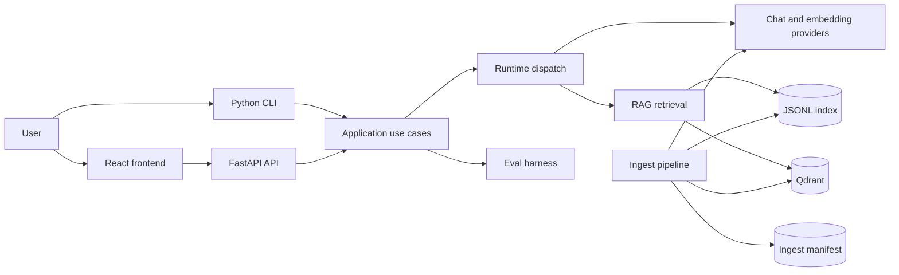

# Project Architecture

This document describes the current runtime boundaries and the dependency rules for
Local Docs RAG Agent. Product requirements remain in `spec.md`; execution priorities
remain in `tasks.md` and `docs/development-roadmap.md`.

## System context



The frontend and CLI are delivery mechanisms. They must not contain retrieval or
provider policy. Both delegate to the same Python application modules.

## Backend layers

### Delivery layer

- `api/app.py`
  - creates FastAPI, middleware, static hosting, and domain-error handlers
- `api/routes.py`
  - maps HTTP requests to application operations
- `api/schemas.py`
  - validates public request and response contracts
- `cli.py` and `commands/`
  - map command-line input to the same application operations
- `presenters.py`
  - converts internal dataclasses into JSON-ready payloads

The delivery layer may import application modules, but application modules must not
import FastAPI, Pydantic, argparse, or frontend concerns.

### Application and runtime layer

- `agent.py`
  - small facade for answering one question
- `runtime/dispatch.py`
  - selects `basic` or `agents_sdk`
- `runtime/basic.py`
  - deterministic retrieve-then-answer orchestration
- `runtime/agents_sdk.py`
  - tool-capable agent orchestration with a request-owned async OpenAI client
- `runtime/shared.py`
  - retrieval, context formatting, citation assembly, and hit merging
- `evals/harness.py`
  - loads eval cases and calculates per-case metrics
- `evals/comparison.py`
  - executes a configuration matrix and builds the leaderboard

Runtime modules coordinate interfaces; they do not construct raw HTTP clients or
implement vector-store protocols themselves.

### Provider layer

- `providers/base.py`
  - chat and embedding interfaces
- `providers/factory.py`
  - the only normal construction point for configured providers
- `providers/chat.py`
  - OpenAI-compatible chat and explicit extractive fallback
- `providers/embedding.py`
  - batching, retry, live embeddings, and deterministic hash fallback
- `providers/openai_client.py`
  - sync/async client construction and proxy policy
- `providers/errors.py`
  - shared provider error classification

Fallback status is data, not success. Every provider exposes a `ProviderStatus`, and
Qdrant operations reject fallback embeddings because their dimension/meaning may not
match the live collection.

### RAG and persistence layer

- `rag/chunker.py`
  - fixed, paragraph, and Markdown-aware chunking with source spans
- `rag/ingest.py`
  - source discovery, change planning, embedding attachment, and store commit
- `rag/manifest.py`
  - typed checksum/chunk manifest
- `rag/store.py`
  - `ChunkStore` protocol and local JSONL implementation
- `rag/qdrant_store.py`
  - Qdrant collection lifecycle, pagination, delete/upsert, and error normalization
- `rag/scoring.py`
  - local dense/lexical/metadata scoring
- `rag/file_io.py`
  - atomic text-file replacement

The ingest order is deliberate:

1. validate and read `DOCS_DIR`
2. load the typed manifest
3. compare the retrieval/embedding fingerprint and calculate removed/changed sources
4. chunk only the required sources
5. attach and validate embeddings
6. update the selected store
7. atomically replace the manifest

If a changed document becomes empty, it is still included in Qdrant replacement
deletes so old points cannot survive.

### Domain layer

- `config.py`
  - immutable validated runtime configuration
- `models.py`
  - chunks, hits, answers, diagnostics, and eval records
- `exceptions.py`
  - stable expected-failure taxonomy shared by API, CLI, and eval

These modules are dependency-light and contain no framework-specific response types.

## Frontend boundary

`frontend/` is a Vite + React + TypeScript client. It consumes only `/api/*` contracts.
The current `frontend/src/App.tsx` still owns most request, state, and rendering logic;
splitting API types/client code, feature hooks, and result panels is a documented
follow-up rather than part of the Python refactor.

## State ownership

| State | Owner | Durability |
| --- | --- | --- |
| Environment configuration | `AppConfig` | process/request snapshot |
| Source documents | user-selected `DOCS_DIR` | external filesystem |
| Local chunks | `LocalJsonlChunkStore` | atomic JSONL file |
| Qdrant chunks | `QdrantChunkStore` | remote collection |
| Source checksums/chunk IDs/index fingerprint | `IngestManifest` | atomic JSON file |
| Provider health | provider instance | operation lifetime |
| Retrieved hits | runtime context | single answer run |
| Eval result | eval harness/presenter | run payload or report file |

## Failure contract

Expected failures derive from `LocalDocsError`:

- `ConfigurationError` and `DataFormatError` -> HTTP 400
- `ProviderUnavailableError` and `VectorStoreError` -> HTTP 503
- CLI -> concise error and exit code 1
- eval matrix -> explicit `skipped` or `error` run, never silent success

Eval matrix execution is capped at 128 combinations so API or CLI input cannot
accidentally expand into an unbounded Cartesian workload.

Unexpected programming errors are not converted into fallback success and remain
visible during development.

## Extension rules

To add a provider:

1. implement the interface in `providers/base.py`
2. expose truthful `ProviderStatus`
3. add construction in `providers/factory.py`
4. add provider-specific configuration validation and tests

To add a vector store:

1. implement `ChunkStore`
2. define replacement/deletion semantics explicitly
3. normalize operational failures into `VectorStoreError`
4. wire construction in `rag/ingest.py`
5. add lifecycle and retrieval tests

To add a runtime:

1. return a complete `AgentAnswer`
2. preserve requested vs actual runtime diagnostics
3. use `runtime/shared.py` for citation assembly where possible
4. add dispatch and API/CLI configuration validation

## Quality gates

Run these before merging backend changes:

```powershell
python -m ruff check backend/src tests scripts
python -m mypy backend/src
python -m pytest
python -m compileall -q backend/src
pnpm run build
```

Live Qdrant/provider verification is a separate environment-dependent gate and must
be reported separately from deterministic offline tests.
