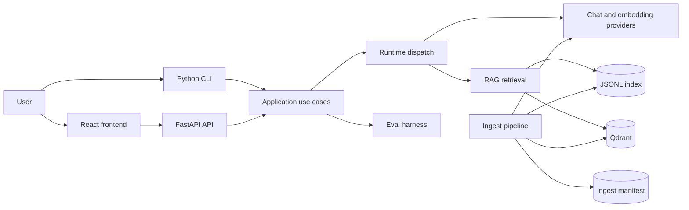

# Project Architecture

This document describes the current runtime boundaries and the dependency rules for
Local Docs RAG Agent. Product requirements remain in `spec.md`; execution priorities
remain in `tasks.md` and `docs/planning/development-roadmap.md`.

## System context



The frontend and CLI are delivery mechanisms. They must not contain retrieval or
provider policy. Both delegate to the same Python application modules.

## Backend layers

### Delivery layer

- `api/app.py`
  - creates FastAPI, middleware, static hosting, and domain-error handlers
- `api/routes.py`
  - maps HTTP requests to application operations
- `api/schemas.py`
  - validates public request and response contracts, using the option types from
    `core.constants` rather than re-declaring them
- `cli.py`
  - builds the argument parser; each subcommand registers itself and binds a handler
    with `set_defaults(handler=...)`, so `main` has no per-command branching
- `commands/`
  - the handlers themselves, taking an `AppConfig` plus parsed arguments
- `presenters.py`
  - converts internal dataclasses into JSON-ready payloads through small composable
    serializers that the API, the CLI, and the eval report all share

The delivery layer may import application modules, but application modules must not
import FastAPI, Pydantic, argparse, or frontend concerns.

### Application and runtime layer

- `agent.py`
  - small facade for answering one question
- `runtime/dispatch.py`
  - selects `basic` or `agents_sdk`
- `runtime/basic.py`
  - deterministic retrieve-then-answer orchestration
- `runtime/agents_sdk.py`
  - tool-capable agent orchestration with a request-owned async OpenAI client
- `runtime/shared.py`
  - context formatting, citation assembly, and hit merging
- `evals/harness.py`
  - loads eval cases and calculates per-case metrics
- `evals/comparison.py`
  - executes a configuration matrix and builds the leaderboard

Runtime modules coordinate interfaces; they do not construct raw HTTP clients or
implement vector-store protocols themselves.

The prompt-context layout that `runtime/shared.py` produces is a contract, not a style
choice. Each hit is one block introduced by an `[S1]`, `[S2]` marker, with every label
starting at column 0 and the multi-line body as the final field. The extractive
fallback in `providers/chat.py` parses those blocks back out when no live model is
available, so an indented or reordered block silently disables the fallback: it reports
that no supporting context was found even though retrieval succeeded and citations
exist. Build these blocks by joining lines explicitly. Do not use an indented
`textwrap.dedent` template, because an interpolated chunk body almost always contains a
line at column 0, which leaves `dedent` with nothing to strip.

### Provider layer

- `providers/base.py`
  - chat and embedding interfaces
- `providers/factory.py`
  - the only normal construction point for configured providers
- `providers/chat.py`
  - OpenAI-compatible chat and explicit extractive fallback
- `providers/embedding.py`
  - batching, retry, live embeddings, and deterministic hash fallback
- `providers/openai_client.py`
  - sync/async client construction and proxy policy
- `providers/errors.py`
  - shared provider error classification

Fallback status is data, not success. Every provider exposes a `ProviderStatus`, and
Qdrant operations reject fallback embeddings because their dimension/meaning may not
match the live collection.

### RAG and persistence layer

- `rag/__init__.py`
  - the package facade; code outside `rag` imports from here, not from the modules below
- `rag/base.py`
  - the `ChunkStore` protocol, with no implementation attached
- `rag/discovery.py`
  - document discovery and reading, also used to answer "what can this agent see?"
- `rag/chunker.py`
  - fixed, paragraph, and Markdown-aware chunking with source spans
- `rag/store_factory.py`
  - the only place that turns `VECTOR_BACKEND` into a concrete store
- `rag/pipeline.py`
  - composes the retrieval stages: search the store, rerank the candidates, report
    the health of both. Every caller that retrieves for an answer goes through here
- `rag/ingest.py`
  - change planning, embedding attachment, store commit, and index fingerprinting
- `rag/manifest.py`
  - typed checksum/chunk manifest
- `rag/local_store.py`
  - the JSONL implementation of `ChunkStore`
- `rag/qdrant_store.py`
  - Qdrant collection lifecycle, pagination, delete/upsert, and error normalization
- `rag/retrieval.py`
  - the ranking pipeline: selects a strategy, ranks candidates, fuses, truncates
- `rag/bm25.py`
  - Okapi BM25 with inverse document frequency and term-frequency saturation
- `rag/fusion.py`
  - reciprocal rank fusion, for combining rankings that share no common scale
- `rag/rerank.py`
  - the `Reranker` protocol and the `none` reranker that keeps first-stage order
- `rag/llm_rerank.py`
  - reorders a candidate window with one chat call, degrading to first-stage order
- `rag/scoring.py`
  - the tokenizer, cosine similarity, and the original blended chunk score
- `rag/file_io.py`
  - atomic text-file replacement

The dependency direction inside the package runs one way:

```text
discovery -> chunker -> ingest -> pipeline -> store_factory -> base / local_store
                                                            -> qdrant_store
                                                            -> retrieval -> bm25
                                                                         -> fusion
                                           -> rerank -> llm_rerank
```

`base` and `models` sit at the bottom and import nothing from the layers above them.
Store construction lives in `store_factory` rather than `ingest`, so retrieval and the
agent tools can build a store without importing the ingest pipeline.

`pipeline` sits at the top and is the only module that knows retrieval has two stages.
That is what keeps a store unaware that reranking exists and a reranker unaware of which
backend produced its candidates, and it is why the second stage cannot be skipped by
accident: there is one retrieval entry point, and it returns both stage statuses.

On Qdrant, `blended` is the server's dense cosine order: the payload has no
vectors to mix with BM25. Compare backends with `dense` and `hybrid_rrf`, not
`blended`. Local `blended` remains `max(dense, lexical, mix)`.

The ingest order is deliberate:

1. validate and read `DOCS_DIR` before writing anything
2. load the typed manifest
3. compare the retrieval/embedding fingerprint and calculate removed/changed sources
4. chunk only the required sources
5. attach and validate embeddings
6. update the selected store
7. atomically replace the manifest

If a changed document becomes empty, it is still included in Qdrant replacement
deletes so old points cannot survive.

If a Qdrant save deletes a source and then fails to upsert, the manifest records
those paths in `needs_reindex` so a later ingest *or* `ensure_index` (Ask/eval)
with a matching checksum still attempts restore instead of claiming the source
is already indexed.

### Domain layer (`core/`)

Coding-agent contracts live next to the code (`*/AGENTS.md`). Root `AGENTS.md`
is the router; this file stays the system diagram.

- `core/constants.py`
  - the closed option sets shared by every layer: runtimes, chunk strategies, vector
    backends, API styles, retrieval strategies, and rerankers. The runtime tuples are
    derived from the `Literal` aliases
    with `typing.get_args`, so the static type and the runtime validation cannot drift
- `core/env.py`
  - typed environment readers and value validators
- `core/models.py`
  - chunks, hits, answers, diagnostics, and eval records
- `core/exceptions.py`
  - stable expected-failure taxonomy shared by API, CLI, and eval
- `core/file_io.py`
  - atomic text replacement used by the local index, ingest manifest, and
    compare reports
- `config/` (`AppConfig`)
  - immutable validated runtime configuration; declares *what* is configured,
    while `core/env.py` owns *how* each value is read and checked

These modules are dependency-light and contain no framework-specific response types.
`core/constants.py` sits at the very bottom and imports nothing from the project
at all. `core` must not import `rag`, `runtime`, `evals`, or `api`.

## Frontend boundary

`frontend/` is a Vite + React + TypeScript client. It consumes only `/api/*` contracts:

- `types/api.ts` owns backend-facing TypeScript contracts
- `lib/api.ts` owns HTTP and structured API errors
- `lib/presentation.ts` owns display-only formatting
- `hooks/useRagWorkspace.ts` owns workspace state and actions
- `components/` owns focused panels and result rendering
- `App.tsx` only composes the page layout

## State ownership

| State | Owner | Durability |
| --- | --- | --- |
| Environment configuration | `AppConfig` | process/request snapshot |
| Source documents | user-selected `DOCS_DIR` | external filesystem |
| Local chunks | `LocalJsonlChunkStore` | atomic JSONL file |
| Qdrant chunks | `QdrantChunkStore` | remote collection |
| Source checksums/chunk IDs/index fingerprint | `IngestManifest` | atomic JSON file |
| Provider health | provider instance | operation lifetime |
| Retrieved hits | runtime context | single answer run |
| Eval result | eval harness/presenter | run payload or report file |

## Failure contract

Expected failures derive from `LocalDocsError`:

- `ConfigurationError` and `DataFormatError` -> HTTP 400
- `ProviderUnavailableError` and `VectorStoreError` -> HTTP 503
- CLI -> concise error and exit code 1
- eval matrix -> explicit `skipped`, `error`, or `degraded` run, never silent
  success. Fallback chat/embedding/runtime cells are `degraded` and stay off
  the leaderboard

Eval matrix execution is capped at 128 combinations so API or CLI input cannot
accidentally expand into an unbounded Cartesian workload.

Unexpected programming errors are not converted into fallback success and remain
visible during development.

Per-case eval results retain the same runtime/provider diagnostics as interactive
answers, allowing strict live verification to reject degradation anywhere in a run.

## Extending and verifying

Recipes for adding a provider, vector store, runtime, reranker, retrieval
strategy, comparison axis, CLI command, or configuration setting are in the
[extension guide](../development/extending.md). The quality-gate commands
live in [AGENTS.md](../../AGENTS.md#quality-gates), and the
[workflow guide](../development/workflow.md) says what each one guards and
where CI runs it.

Live Qdrant and provider verification is a separate, environment-dependent
check, reported separately from the deterministic offline gates.
