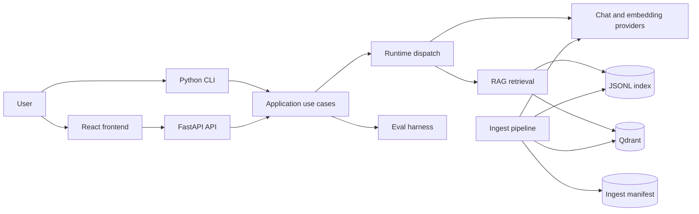

# Project Architecture

This document describes the current runtime boundaries and the dependency rules for
Local Docs RAG Agent. Product requirements remain in `spec.md`; execution priorities
remain in `tasks.md` and `docs/planning/development-roadmap.md`.

## System context


```mermaid
flowchart LR
    User[User] --> UI[React frontend]
    User --> CLI[Python CLI]
    UI --> API[FastAPI API]
    CLI --> UseCases[Application use cases]
    API --> UseCases
    UseCases --> Runtime[Runtime dispatch]
    Runtime --> Providers[Chat and embedding providers]
    Runtime --> Retrieval[RAG retrieval]
    Retrieval --> Local[(JSONL index)]
    Retrieval --> Qdrant[(Qdrant)]
    UseCases --> Eval[Eval harness]
    Ingest[Ingest pipeline] --> Providers
    Ingest --> Local
    Ingest --> Qdrant
    Ingest --> Manifest[(Ingest manifest)]
```

The frontend and CLI are delivery mechanisms. They must not contain retrieval or
provider policy. Both delegate to the same Python application modules.

## Backend layers

### Delivery layer

- `api/app.py`
  - creates FastAPI, middleware, static hosting, and domain-error handlers
- `api/routes.py`
  - maps HTTP requests to application operations
- `api/schemas.py`
  - validates public request and response contracts, using the option types from
    `core.constants` rather than re-declaring them
- `cli.py`
  - builds the argument parser; each subcommand registers itself and binds a handler
    with `set_defaults(handler=...)`, so `main` has no per-command branching
- `commands/`
  - the handlers themselves, taking an `AppConfig` plus parsed arguments
- `presenters.py`
  - converts internal dataclasses into JSON-ready payloads through small composable
    serializers that the API, the CLI, and the eval report all share

The delivery layer may import application modules, but application modules must not
import FastAPI, Pydantic, argparse, or frontend concerns.

### Application and runtime layer

- `agent.py`
  - small facade for answering one question
- `runtime/dispatch.py`
  - selects `basic` or `agents_sdk`
- `runtime/basic.py`
  - deterministic retrieve-then-answer orchestration
- `runtime/agents_sdk.py`
  - tool-capable agent orchestration with a request-owned async OpenAI client
- `runtime/shared.py`
  - context formatting, citation assembly, and hit merging
- `evals/harness.py`
  - loads eval cases and calculates per-case metrics
- `evals/comparison.py`
  - executes a configuration matrix and builds the leaderboard

Runtime modules coordinate interfaces; they do not construct raw HTTP clients or
implement vector-store protocols themselves.

The prompt-context layout that `runtime/shared.py` produces is a contract, not a style
choice. Each hit is one block introduced by an `[S1]`, `[S2]` marker, with every label
starting at column 0 and the multi-line body as the final field. The extractive
fallback in `providers/chat.py` parses those blocks back out when no live model is
available, so an indented or reordered block silently disables the fallback: it reports
that no supporting context was found even though retrieval succeeded and citations
exist. Build these blocks by joining lines explicitly. Do not use an indented
`textwrap.dedent` template, because an interpolated chunk body almost always contains a
line at column 0, which leaves `dedent` with nothing to strip.

### Provider layer

- `providers/base.py`
  - chat and embedding interfaces
- `providers/factory.py`
  - the only normal construction point for configured providers
- `providers/chat.py`
  - OpenAI-compatible chat and explicit extractive fallback
- `providers/embedding.py`
  - batching, retry, live embeddings, and deterministic hash fallback
- `providers/openai_client.py`
  - sync/async client construction and proxy policy
- `providers/errors.py`
  - shared provider error classification

Fallback status is data, not success. Every provider exposes a `ProviderStatus`, and
Qdrant operations reject fallback embeddings because their dimension/meaning may not
match the live collection.

### RAG and persistence layer

- `rag/__init__.py`
  - the package facade; code outside `rag` imports from here, not from the modules below
- `rag/base.py`
  - the `ChunkStore` protocol, with no implementation attached
- `rag/discovery.py`
  - document discovery and reading, also used to answer "what can this agent see?"
- `rag/chunker.py`
  - fixed, paragraph, and Markdown-aware chunking with source spans
- `rag/store_factory.py`
  - the only place that turns `VECTOR_BACKEND` into a concrete store
- `rag/pipeline.py`
  - composes the retrieval stages: search the store, rerank the candidates, report
    the health of both. Every caller that retrieves for an answer goes through here
- `rag/ingest.py`
  - change planning, embedding attachment, store commit, and index fingerprinting
- `rag/manifest.py`
  - typed checksum/chunk manifest
- `rag/local_store.py`
  - the JSONL implementation of `ChunkStore`
- `rag/qdrant_store.py`
  - Qdrant collection lifecycle, pagination, delete/upsert, and error normalization
- `rag/retrieval.py`
  - the ranking pipeline: selects a strategy, ranks candidates, fuses, truncates
- `rag/bm25.py`
  - Okapi BM25 with inverse document frequency and term-frequency saturation
- `rag/fusion.py`
  - reciprocal rank fusion, for combining rankings that share no common scale
- `rag/rerank.py`
  - the `Reranker` protocol and the `none` reranker that keeps first-stage order
- `rag/llm_rerank.py`
  - reorders a candidate window with one chat call, degrading to first-stage order
- `rag/scoring.py`
  - the tokenizer, cosine similarity, and the original blended chunk score
- `rag/file_io.py`
  - atomic text-file replacement

The dependency direction inside the package runs one way:

```text
discovery -> chunker -> ingest -> pipeline -> store_factory -> base / local_store
                                                            -> qdrant_store
                                                            -> retrieval -> bm25
                                                                         -> fusion
                                           -> rerank -> llm_rerank
```

`base` and `models` sit at the bottom and import nothing from the layers above them.
Store construction lives in `store_factory` rather than `ingest`, so retrieval and the
agent tools can build a store without importing the ingest pipeline.

`pipeline` sits at the top and is the only module that knows retrieval has two stages.
That is what keeps a store unaware that reranking exists and a reranker unaware of which
backend produced its candidates, and it is why the second stage cannot be skipped by
accident: there is one retrieval entry point, and it returns both stage statuses.

On Qdrant, `blended` is the server's dense cosine order: the payload has no
vectors to mix with BM25. Compare backends with `dense` and `hybrid_rrf`, not
`blended`. Local `blended` remains `max(dense, lexical, mix)`.

### Persistence concurrency decision

Index lifecycle serialization is a single-host, same-user guarantee. Every
local process derives the same advisory lock file from the canonical storage
target, and an explicit per-target thread lock prevents threads in one process
from bypassing the operating-system lock. The owning thread may enter the guard
reentrantly so retrieval can call `ensure_index` while holding readiness and
query under one critical section. A local lock artifact lives beside the
resolved index file. A remote lock artifact lives in the current user's cache
and is named only by the credential-free hashed endpoint-and-collection
identity; neither location depends on a process temporary directory.

The guard covers manifest inspection, dirty-intent publication, store mutation,
clean-manifest publication, and retrieval's readiness-plus-query window. It has
a finite timeout reported as an actionable configuration error. Lock files may
remain after normal exit or process death; they are identity markers, not proof
that a lock is held, and can be left in place. The operating system releases
the advisory lock when the owning process exits.

This does not coordinate different hosts. Deployments with Qdrant writers or
readers on more than one host must provide an external distributed lock or
otherwise guarantee a single lifecycle owner. The application must not claim
multi-host safety from its host-local lock files.

The ingest order is deliberate:

1. acquire the target's reentrant thread and cross-process lifecycle guard
2. validate and read `DOCS_DIR` before writing anything
3. load the typed manifest
4. verify that its hashed storage identity owns the configured target
5. compare the document-scope/retrieval fingerprint and calculate
   removed/changed sources
6. chunk only the required sources
7. attach and validate embeddings
8. atomically publish `repair_required` before any store mutation
9. update the selected store
10. atomically publish the clean manifest

Retrieval holds the same guard while it checks readiness and queries the store.
It enters `ensure_index` reentrantly, captures the embedding status, and
releases the guard before reranking or answer generation. If a process dies
after step 8, the next reader sees `repair_required` and deterministically
rebuilds current sources and replays idempotent stale/replacement deletes.

The versioned manifest separates two concerns. The index fingerprint includes
the resolved `DOCS_DIR`, sorted unique `DOCS_EXCLUDE_PATTERNS`, embedding mode
and model, and chunk settings. Its storage identity is a SHA-256 digest of the
resolved local `INDEX_PATH`, or the canonical credential-free Qdrant endpoint
and collection. API keys, URL user information, queries, fragments, and raw
credential-bearing URLs are never persisted in that identity. Qdrant's
effective REST port is `6333` when omitted; explicit ports such as `80` and
`443` remain distinct storage targets. IPv6 literals use their compressed
form, port `0` is rejected, and malformed endpoint errors do not echo URL
credentials.

The local store resolves its configured index path once when it is built. Its
reads, atomic writes, existence checks, and the manifest identity therefore
refer to the same canonical file. A final-component `INDEX_PATH` symlink,
including one whose target does not exist yet, is preserved rather than
replaced by the first ingest.

Changing scope on the same target rebuilds while the previous source list is
still available, so newly excluded or removed Qdrant sources are deleted.
Changing targets with the same manifest fails before any store mutation and
requires a dedicated manifest or an explicit operator decision to clear and
adopt a confirmed-owned target. Legacy local manifests rebuild safely; legacy
Qdrant manifests cannot be adopted without that ownership decision.

If a changed document becomes empty, it is still included in Qdrant replacement
deletes so old points cannot survive.

If a Qdrant save deletes a source and then fails to upsert, the manifest records
those paths in `needs_reindex` so a later ingest *or* `ensure_index` (Ask/eval)
with a matching checksum still attempts restore instead of claiming the source
is already indexed.

Disposable Qdrant lifecycle uses an ownership-checked facade seam rather than
exposing deletion on `ChunkStore`. A claim succeeds only when its uniquely
named collection is absent and returns an opaque process-issued token bound to
the exact credential-free target identity and collection. Cleanup recomputes
and verifies every field under the same index guard before deleting. It refuses
pre-existing, mismatched, forged, or reused claims, so the configured
interactive collection cannot be deleted through a run-owned token.

A process death loses the in-memory cleanup token and can leave a disposable
collection orphaned. Record each UUID-derived run collection name in comparison
output. Recovery is a targeted operator action: verify the recorded run prefix
and exact collection name in Qdrant, then delete only that collection with
Qdrant administration tooling. Never wildcard-delete collections. A multi-host
claim/create race still requires the external coordination described above.

### Domain layer (`core/`)

Coding-agent contracts live next to the code (`*/AGENTS.md`). Root `AGENTS.md`
is the router; this file stays the system diagram.

- `core/constants.py`
  - the closed option sets shared by every layer: runtimes, chunk strategies, vector
    backends, API styles, retrieval strategies, and rerankers. The runtime tuples are
    derived from the `Literal` aliases
    with `typing.get_args`, so the static type and the runtime validation cannot drift
- `core/env.py`
  - typed environment readers and value validators
- `core/models.py`
  - chunks, hits, answers, diagnostics, and eval records
- `core/exceptions.py`
  - stable expected-failure taxonomy shared by API, CLI, and eval
- `core/file_io.py`
  - atomic text replacement used by the local index, ingest manifest, and
    compare reports
- `config/` (`AppConfig`)
  - immutable validated runtime configuration; declares *what* is configured,
    while `core/env.py` owns *how* each value is read and checked

These modules are dependency-light and contain no framework-specific response types.
`core/constants.py` sits at the very bottom and imports nothing from the project
at all. `core` must not import `rag`, `runtime`, `evals`, or `api`.

## Frontend boundary

`frontend/` is a Vite + React + TypeScript client. It consumes only `/api/*` contracts:

- `types/api.ts` owns backend-facing TypeScript contracts
- `lib/api.ts` owns HTTP and structured API errors
- `lib/presentation.ts` owns display-only formatting
- `hooks/useRagWorkspace.ts` owns workspace state and actions
- `components/` owns focused panels and result rendering
- `App.tsx` only composes the page layout

## State ownership

| State | Owner | Durability |
| --- | --- | --- |
| Environment configuration | `AppConfig` | process/request snapshot |
| Source documents | user-selected `DOCS_DIR` | external filesystem |
| Local chunks | `LocalJsonlChunkStore` | atomic JSONL file |
| Qdrant chunks | `QdrantChunkStore` | remote collection |
| Source checksums/chunk IDs/scope and storage identity | `IngestManifest` | atomic JSON file |
| Provider health | provider instance | operation lifetime |
| Retrieved hits | runtime context | single answer run |
| Eval result | eval harness/presenter | run payload or report file |

## Failure contract

Expected failures derive from `LocalDocsError`:

- `ConfigurationError` and `DataFormatError` -> HTTP 400
- `ProviderUnavailableError` and `VectorStoreError` -> HTTP 503
- CLI -> concise error and exit code 1
- eval matrix -> explicit `skipped`, `error`, or `degraded` run, never silent
  success. Fallback chat/embedding/runtime cells are `degraded` and stay off
  the leaderboard

Eval matrix execution is capped at 128 combinations so API or CLI input cannot
accidentally expand into an unbounded Cartesian workload.

Unexpected programming errors are not converted into fallback success and remain
visible during development.

Per-case eval results retain the same runtime/provider diagnostics as interactive
answers, allowing strict live verification to reject degradation anywhere in a run.

## Extending and verifying

Recipes for adding a provider, vector store, runtime, reranker, retrieval
strategy, comparison axis, CLI command, or configuration setting are in the
[extension guide](../development/extending.md). The quality-gate commands
live in [AGENTS.md](../../AGENTS.md#quality-gates), and the
[workflow guide](../development/workflow.md) says what each one guards and
where CI runs it.

Live Qdrant and provider verification is a separate, environment-dependent
check, reported separately from the deterministic offline gates.
